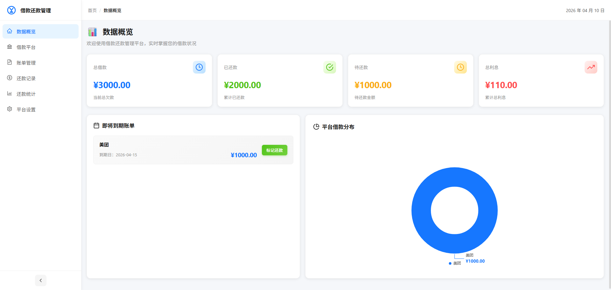
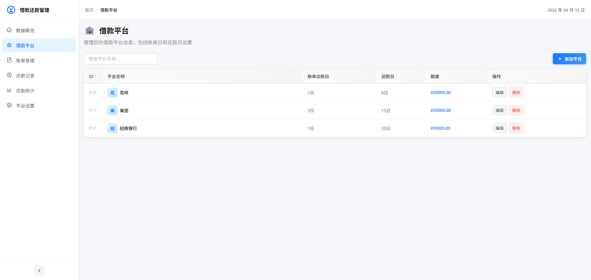
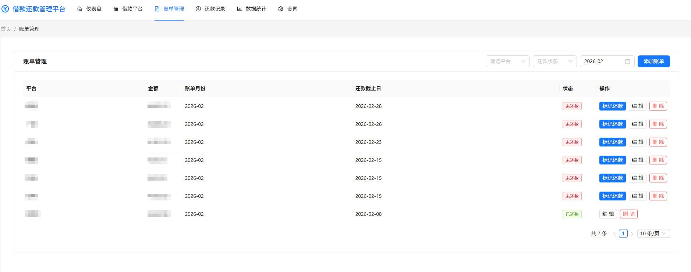
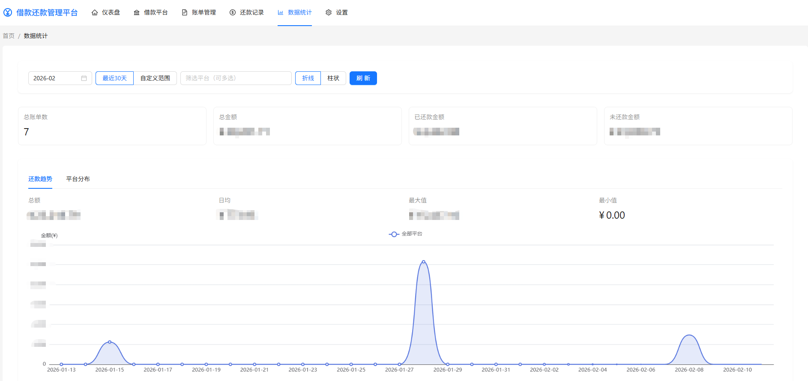
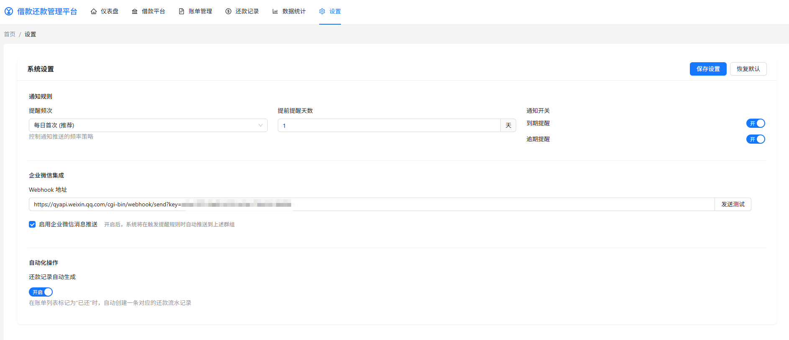

# 借款还款管理系统

一个轻量的借款账单与还款管理平台：把不同平台的账单、还款记录、统计趋势集中到同一个地方，方便你日常对账与复盘。

## 你可以用它做什么

- 维护借款平台信息（出账日、还款日）
- 管理账单（新增/编辑/筛选，按到期优先排序）
- 记录还款（补记流水，查看历史）
- 查看统计（趋势与分布，一眼了解本月情况）
- 设置提醒（到期/逾期提醒 + 测试消息）

## 项目预览

## 建议使用流程

1. 先到“系统设置”完成提醒相关配置，并发送一次测试消息
2. 在“借款平台”把平台基础信息建好（出账日、还款日）
3. 在“账单管理”逐步录入账单
4. 在“还款记录”补充还款流水（或通过“标记已还”生成）
5. 在“数据统计”查看趋势与分布，按月复盘

## 快速开始（新手启动）

### 环境准备

- Node.js（建议 16+）
- MySQL（5.7+/8+）

### 后端

1. 进入后端目录并安装依赖：
   - `cd backend`
   - `npm install`
2. 配置环境变量（`backend/.env`）：
   - `DB_HOST`、`DB_PORT`、`DB_USER`、`DB_PASSWORD`、`DB_NAME`
   - `SERVER_PORT`（默认 `9502`）
3. 初始化数据库（可选）：
   - `node scripts/init-database.js`
4. 启动服务：
   - `npm run dev`（默认在 `http://localhost:9502/` 提供 API）

### 前端

1. 进入前端目录并安装依赖：
   - `cd frontend`
   - `npm install`
2. 确认 API 地址（`frontend/.env`）：
   - `VUE_APP_API_BASE_URL=http://localhost:9502/api`
3. 启动前端：
   - `npm run dev`（默认在 `http://localhost:9002/` 提供管理界面）

启动后，打开浏览器进入管理界面即可开始使用。

如果遇到“找不到脚本命令”的提示，以项目里的 `package.json` 为准（后端常见为 `npm run start/dev`，前端常见为 `npm run serve/dev`）。

## 首次使用清单（推荐）

- 在“系统设置”完成提醒配置，并点击“发送测试消息”确认能收到
- 在“借款平台”新增平台，并填写出账日/还款日
- 在“账单管理”录入本月账单（先从常用平台开始）
- 在“还款记录”补记已还款项，保持数据完整
- 在“数据统计”按月查看趋势与分布

## 提醒说明

- 到期提醒：在“提前提醒天数”范围内的未还账单会提醒
- 逾期提醒：启用后，对已过“还款截止日”的未还账单发送提醒
- 测试消息：系统设置页可一键发送示例消息，用于确认提醒通道正常
